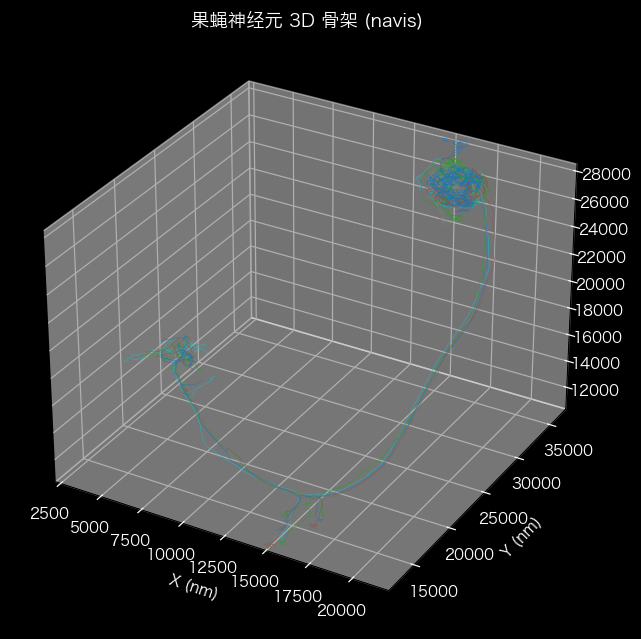
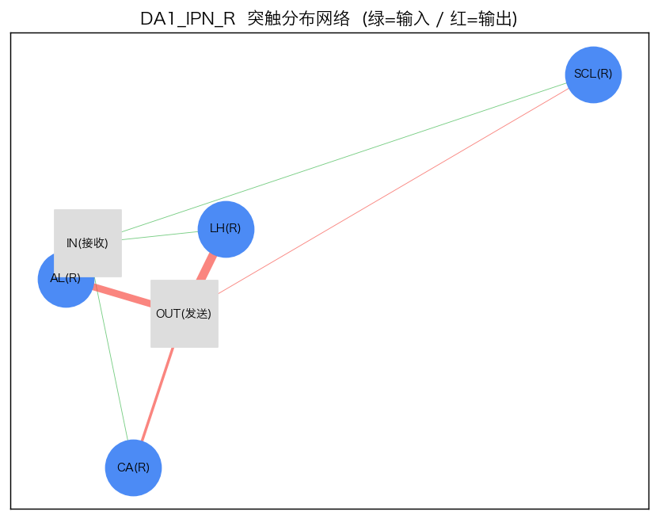
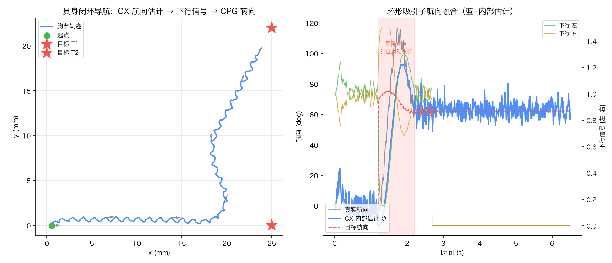
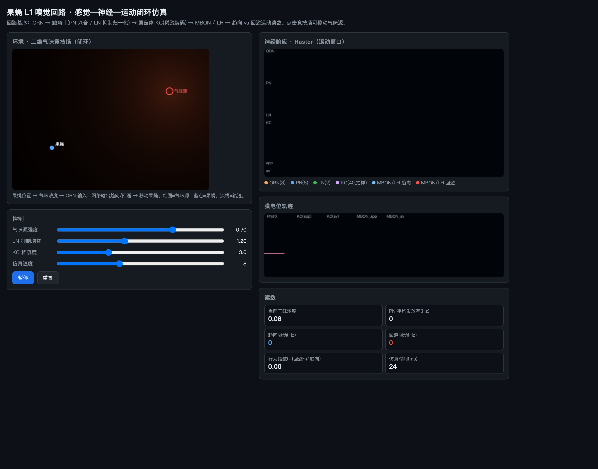
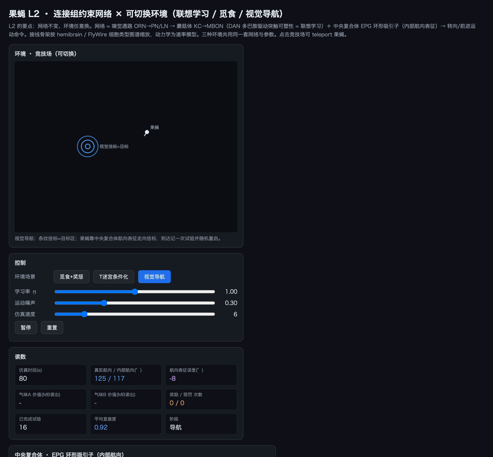

# FlyConnectome

果蝇连接组驱动的具身行为仿真平台 —— 从单神经元形态到闭环导航，逐级构建、全离线可跑。


## 架构概览

```
L0  神经元形态可视化         navis + matplotlib → 3D 投影 + 突触网络图
L1  嗅觉回路脉冲仿真         OR → PN → LN → KC（单文件 HTML，WebAudio）
L2  连接组约束 × 环境闭环    CX 环形吸引子航向 + 三种行为范式（HTML canvas）
L3  具身神经力学仿真          NeuroMechFly v2 / MuJoCo / flygym + MJPC
Pond 3D 神经元验证沙盒        Three.js + LIF + L1 嗅觉消融
```




## 目录结构

```
├── l3_workbench/           # L3 可视化工作台（HTTP 服务 + MuJoCo worker）
│   ├── server.py           #   本机 HTTP 服务 + 子进程管理
│   ├── worker.py           #   物理仿真进程
│   ├── config.py           #   参数校验
│   └── static/             #   前端（零外部依赖）
│       ├── index.html      #     工作台主界面
│       ├── learning.html   #     图片奖励学习模块
│       ├── pond.html       #     池塘 3D 神经元验证场景
│       ├── pond-*.js       #     行为 / 水面 / 神经元 / 气味 / 检视器
│       └── vendor/         #     Three.js r162 (ES module)
├── nmf_ctrl/               # 运动控制栈（CPG + CX 环形吸引子 + 转向）
├── scripts/                # 独立演示脚本
│   ├── demo_neuron.py      #   L0：神经元加载 → 可视化
│   ├── fly_l1_sim.html     #   L1：嗅觉回路脉冲仿真
│   ├── fly_l2_sim.html     #   L2：连接组约束 + CX 航向
│   ├── l3_walk.py          #   L3a：CPG 直线行走
│   └── l3_closedloop.py    #   L3b：具身闭环导航
├── assets/                 # 输出图片与视频
│   ├── images/             #   各级仿真截图
│   └── videos/             #   行走 / 导航视频
├── docs/                   # 设计文档与验证报告
├── tests/                  # 自动测试（HTTP + 物理集成 + 前端）
├── environment-web.yml     # conda 环境（网页服务用）
└── start_l3.command         # macOS 一键启动
```

## 快速开始

### 环境准备

```bash
# 网页服务（Python 标准库，秒装）
conda env create --prefix .conda-web -f environment-web.yml

# 物理仿真环境（需要 flygym + MuJoCo，约 460 MB）
# 参考 NeuroMechFly 官方安装文档
```

### L3 工作台

```bash
./start_l3.command
# 或手动：
.conda-web/bin/python -m l3_workbench.server --port 8873
```

浏览器打开 <http://127.0.0.1:8873>：

| 页面 | 地址 | 说明 |
|---|---|---|
| 工作台 | `/` | 具身闭环导航 + MJPC 在线规划 |
| 图片奖励学习 | `/learning.html` | 简化策略梯度 + L3 身体联动 |
| 池塘 3D 场景 | `/pond.html` | 神经元验证消融实验 |

### 独立脚本

```bash
.venv/bin/python scripts/demo_neuron.py          # L0（需 navis）
open scripts/fly_l1_sim.html scripts/fly_l2_sim.html  # L1/L2（浏览器直接打开）
MUJOCO_GL=glfw ./.venv-l3/bin/python scripts/l3_walk.py        # L3a 直线行走
MUJOCO_GL=glfw ./.venv-l3/bin/python scripts/l3_closedloop.py  # L3b 闭环导航
```

## L3 具身闭环



架构：身体（MuJoCo 物理）→ 感觉（体姿 + 罗盘）→ 中枢（CX 环形吸引子）→ 下行信号 [左,右] → 脊髓（三脚架 CPG）→ 42 腿关节执行器。

- CX 航向积分：自运动 `dψ = ω·dt` 精确平移活动包；罗盘 von Mises 锚定；遮挡时纯路径积分
- 控制周期 10 ms，物理 0.1 ms；角速度 120 ms 低通滤除 7.4 Hz 步态摆头
- 转向增益由 0.6s 开环探针自动标定



## 池塘 3D 神经元验证



基于 Three.js 的浏览器端沙盒：青蛙坐在中央荷叶上，果蝇群围绕岸边腐烂水果飞行。全部行为由内置神经元模型驱动，不依赖 MuJoCo worker。

### 神经元模型

| 回路 | 模型 | 可验证现象 |
|---|---|---|
| L1 嗅觉 (ORN→PN→LN→KC) | 四级递推 + 适应 + 侧抑制 | ORN 适应→离开水果；LN 关闭→全场聚集 |
| Giant Fiber (LIF) | V/θ/AHP + 致敏/习惯化可塑性 | 同伴被抓→附近果蝇"惊弓之鸟"；反复落叶→习惯化 |

### 消融实验

参数面板 7 个开关逐层关闭，观察行为差异：

1. 关闭 `OR 通道` → 果蝇完全忽略水果
2. 关闭 `ORN 适应` → 果蝇贴住水果不走
3. 关闭 `LN 侧抑制` → 远距果蝇也飞向水果
4. 关闭 `GF LIF` → 回退概率逃逸（对照组）
5. 关闭 `致敏/习惯化` → 目睹同类被吃后无行为变化
6. 点果蝇 → 开启检视器看实时四级曲线 + V/θ/AHP sparkline

### 青蛙状态机

`IDLE → LOCK（反应延迟）→ STRIKE（弹舌）→ RETRACT → CHEW`。眼球追踪视野内果蝇，仅在舌头射程内发起攻击。水面 Shader 含顶点位移 + Fresnel + 涟漪传播。

## 测试

```bash
# Python（HTTP 路由 + 物理集成）
.conda-web/bin/python -m unittest discover -s tests -v

# 前端 JS
node --test tests/test_sync.cjs tests/test_learning*.cjs
```

13 个 HTTP 路由测试 + 6 个物理集成测试（需 GLFW）。

## 关键实现说明

- **全离线**：Three.js r162 vendor 为 ES module，无 CDN；CSP `script-src 'self'`
- **服务器安全**：`static/` 通用映射 + 扩展名白名单 + 路径穿越防护 + 动态 session token
- **果蝇飞行**：高度 P-D 伺服（非气动力学），重力仅作微扰；避免不自然集体落水
- **数据**：示例神经元来自 navis 内置 FAFB 重建（DA1_lPN_R 等），真实形态数据

## 许可证

Apache-2.0（nmf_ctrl 部分移植自 NeuroMechFly v2 官方实现）
